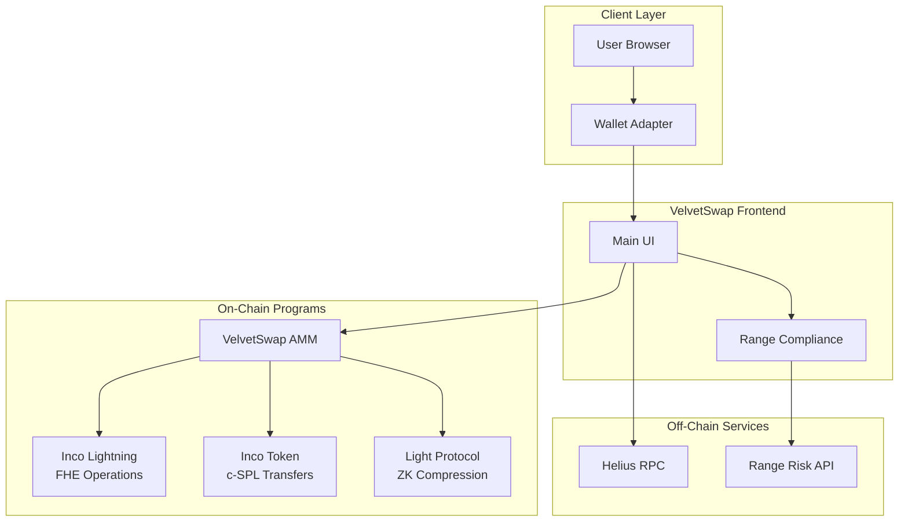
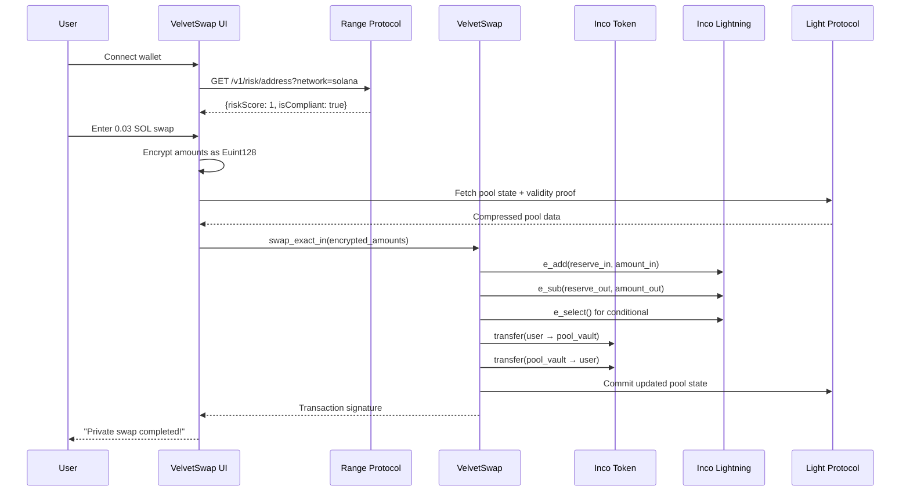
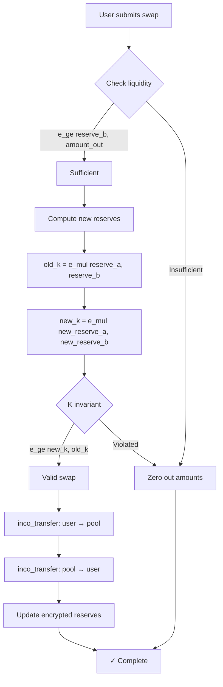
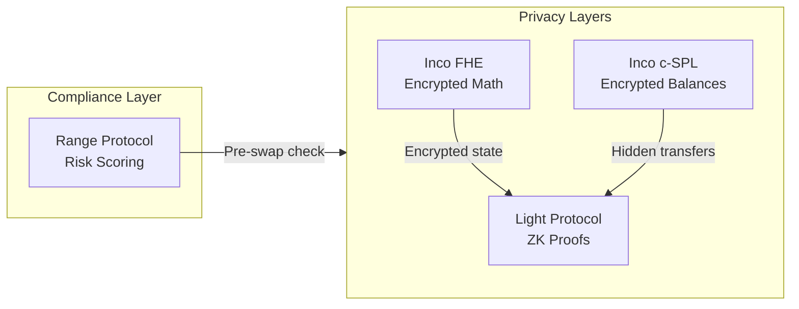

# VelvetSwap Architecture

## Overview

VelvetSwap is a privacy-first confidential swap terminal for Solana with integrated compliance, combining:

- **Inco Lightning (FHE)** — Pool reserves encrypted, swap math on ciphertext
- **Inco Token (c-SPL)** — Confidential token balances and transfers
- **Light Protocol V2 (ZK)** — Pool state stored as ZK-compressed account
- **Range Protocol (Compliance)** — Sanctions screening and risk scoring

## Privacy + Compliance Stack

| Layer | Technology | Purpose |
|-------|------------|------------------|
| **FHE (Inco Lightning)** | Homomorphic encryption | Pool reserves, swap amounts, fees encrypted as `Euint128` |
| **c-SPL (Inco Token)** | Confidential tokens | User balances encrypted, transfers hide amounts |
| **ZK (Light Protocol V2)** | Zero-knowledge proofs | Pool state in compressed accounts with validity proofs |
| **Compliance (Range)** | Risk API | Sanctions screening & wallet risk scoring before swaps |

## Verified Deployment (Devnet)

| Component | Address | Status |
|-----------|---------|--------|
| VelvetSwap Program | `4b8jCufu7b4WKXdxFRQHWSks4QdskW62qF7tApSNXuZD` | ✅ Deployed |
| Inco Token Program | `CYVSeUyVzHGVcrxsJt3E8tbaPCQT8ASdRR45g5WxUEW7` | ✅ Deployed |
| Inco Lightning Program | `5sjEbPiqgZrYwR31ahR6Uk9wf5awoX61YGg7jExQSwaj` | ✅ Deployed |
| Pool Authority PDA | `DSM8WDdZ5s3xkKbjtmzxpd59J42cuTZ1AJtFJTzLMkFS` | ✅ Active |
| Example Swap TX | [View on Explorer](https://explorer.solana.com/tx/3kbJFHbfGKVKyf6xEs5jLnWcYnRjh7mNQa6o6kXjbRhGQb8kQMhnzhFaQA8WDE4joHGExxmguSRTJfGqMXpeHogB?cluster=devnet) | ✅ Confirmed |

## System Architecture



## Component Details

| Component | Technology | Purpose |
|-----------|------------|---------|
| **VelvetSwap AMM** | Anchor (Rust) | Confidential AMM with encrypted reserves |
| **Inco Lightning** | Inco Network | FHE math via `Euint128` (e_add, e_sub, e_mul, e_ge, e_select) |
| **Inco Token** | c-SPL | Confidential token balances and transfers |
| **Light Protocol** | ZK Compression | Compressed pool state with validity proofs |
| **Range Protocol** | Risk API | Sanctions screening (OFAC/EU/UK) and ML risk scoring |

---

## Confidential Swap Flow



## Program Instructions

| Instruction | Description |
|-------------|-------------|
| `initialize_pool` | Create compressed pool with encrypted zero reserves |
| `add_liquidity` | Deposit encrypted token amounts (authority only) |
| `remove_liquidity` | Withdraw encrypted token amounts (authority only) |
| `swap_exact_in` | Execute swap with FHE constant-product math |

### Swap Logic (Encrypted)



## Privacy Properties

| Property | Implementation |
|----------|----------------|
| **Encrypted reserves** | `reserve_a`, `reserve_b` stored as `Euint128` |
| **Encrypted transfers** | All token movements via Inco Token c-SPL |
| **Encrypted math** | `e_add`, `e_sub`, `e_mul`, `e_ge`, `e_select` on ciphertext |
| **Compressed state** | Light Protocol ZK validity proofs |
| **Compliance** | Range Protocol blocks sanctioned addresses |

---

## Security & Compliance Model



| Layer | Protection |
|-------|------------|
| **FHE Encryption** | Inco Lightning encrypts all pool reserves and swap amounts |
| **c-SPL Tokens** | Inco Token hides user balances from observers |
| **ZK Compression** | Light Protocol validates state without revealing data |
| **Compliance** | Range API blocks sanctioned/high-risk addresses (score ≥ 5) |

---

## File Structure

```
velvet-rope/
├── src/
│   ├── app/
│   │   └── page.tsx              # Main swap UI with compliance
│   ├── lib/
│   │   ├── swap-client.ts        # VelvetSwap program client
│   │   ├── range-compliance.ts   # Range Protocol integration
│   │   └── inco-account-manager.ts # Inco Token account helpers
│   └── idl/
│       └── light_swap_psp.json   # Program IDL
└── public/
```

## Related Links

| Resource | URL |
|----------|-----|
| On-Chain Program | [private_swap_programs](../private_swap_programs) |
| Inco Lightning | https://docs.inco.org/svm/home |
| Light Protocol | https://docs.lightprotocol.com |
| Range Protocol | https://docs.range.org/risk-api/risk-introduction |

