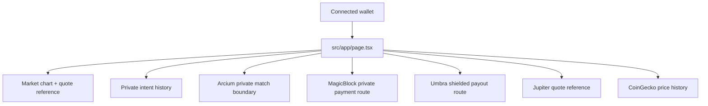
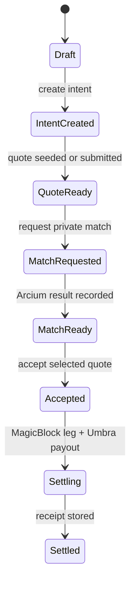

# VelvetMesh Frontend Architecture

> Private intent trading UI for Solana devnet.

## System Goal

The frontend is the presentation layer for VelvetMesh. It turns a private trade into a visible product flow without pretending the sponsor rails are interchangeable. The user sees one experience:

1. Create a private intent.
2. Request and accept a private quote.
3. Settle the USDC leg through MagicBlock.
4. Shield the wSOL payout balance through Umbra.
5. Track receipts and intent history.

Arcium is the match boundary. MagicBlock and Umbra are the settlement rails. Jupiter and CoinGecko are the public market references.

## Current Client Shape

```mermaid
graph TB
    USER["Connected wallet"]
    PAGE["src/app/page.tsx"]
    HISTORY["Private intent history"]
    CHART["Market chart + quote reference"]
    ARCIUM["Arcium private match boundary"]
    MAGIC["MagicBlock private payment route"]
    UMBRA["Umbra shielded payout route"]
    JUPITER["Jupiter quote reference"]
    COINGECKO["CoinGecko price history"]

    USER --> PAGE
    PAGE --> CHART
    PAGE --> HISTORY
    PAGE --> ARCIUM
    PAGE --> MAGIC
    PAGE --> UMBRA
    PAGE --> JUPITER
    PAGE --> COINGECKO
```

## Important Routes

| Route | Role |
|-------|------|
| `/api/velvetmesh/status` | Backend health and route readiness |
| `/api/velvetmesh/intents` | Intent history and private flow state |
| `/api/quotes/jupiter` | Live quote reference |
| `/api/market/coingecko` | Historical market chart data |
| `/api/magicblock/private-transfer` | Private USDC settlement payloads |
| `/api/umbra/settlement` | Umbra shielded balance actions |

## Flow Model

```mermaid
stateDiagram-v2
    [*] --> Draft
    Draft --> IntentCreated: create intent
    IntentCreated --> QuoteReady: quote seeded or submitted
    QuoteReady --> MatchRequested: request private match
    MatchRequested --> MatchReady: Arcium result recorded
    MatchReady --> Accepted: accept selected quote
    Accepted --> Settling: MagicBlock leg + Umbra payout
    Settling --> Settled: receipt stored
```

## Key Design Rules

- Keep the main CTA as the product action, not an infra action.
- Show sponsor names only where they explain real behavior.
- Fail closed when the devnet signer or route config is missing.
- Store settlement plans separately from the visible amount input so refreshes do not change the execution amount.
- Only show the two-rail settlement path for the supported `USDC -> SOL` flow.

## Operational Notes

- The frontend runs on Next.js App Router.
- The app expects devnet RPC and Umbra config in `.env.local`.
- Receipt state is persisted locally for UX continuity and is also backed by the app routes.
- The live chart is reference data only; execution still goes through the private settlement flow.

## Why This Shape Works

The UI reads like a product because it separates three distinct concerns:

- public market reference
- private matching
- private settlement receipts

That keeps the product honest while still showing the full end-to-end flow the user can verify on devnet.
