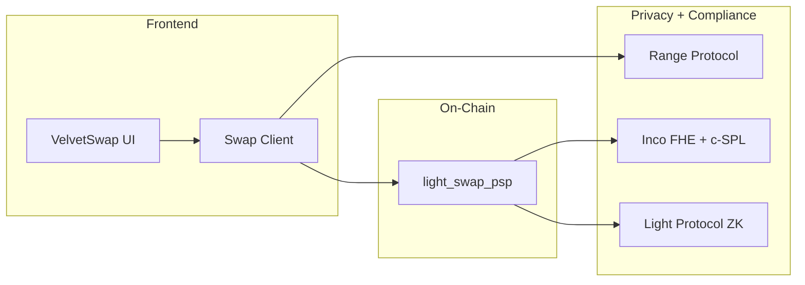
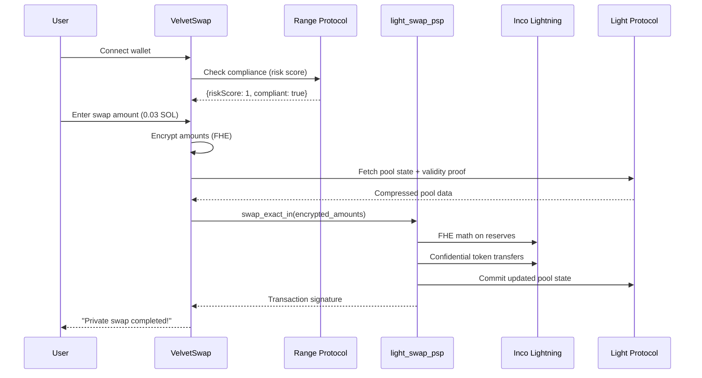

# VelvetSwap Frontend

<p align="center">
  <strong>Privacy-First Confidential Swap Interface for Solana</strong><br/>
  A beautiful, modern frontend for the VelvetSwap confidential AMM.
</p>

<p align="center">
  
  
  
</p>

---

## Overview

VelvetSwap is the frontend interface for the first **fully confidential AMM on Solana**. It connects to the `light_swap_psp` program to execute swaps where amounts, reserves, and fees are all encrypted.



---

## Features

- **Triple-Layer Privacy** — FHE encryption + ZK compression + Range compliance
- **Privacy Mode Toggle** — Show/hide estimated output amounts
- **Real-time Pool Status** — Checks pool availability on load
- **Wallet Integration** — Solana Wallet Adapter support
- **Modern UI** — Glassmorphism, glow effects, smooth animations
- **Responsive Design** — Works on desktop and mobile

---

## Tech Stack

| Component | Technology |
|-----------|------------|
| **Framework** | Next.js 14 (App Router) |
| **Styling** | TailwindCSS + Custom CSS |
| **Wallet** | Solana Wallet Adapter |
| **Blockchain** | Solana Devnet |
| **Privacy** | Inco FHE, Light Protocol ZK, Range Compliance |
| **RPC** | Helius (with Light Protocol indexer) |

---

## Quick Start

### Prerequisites

- Node.js 18+
- A Solana wallet (Phantom, Solflare, etc.)

### Installation

```bash
# Clone the repository
git clone <repo-url>
cd velvet-rope

# Install dependencies
npm install

# Start development server
npm run dev
```

Open [http://localhost:3000](http://localhost:3000) to see VelvetSwap.

---

## Swap Flow



---

## Project Structure

```
velvet-rope/
├── src/
│   ├── app/
│   │   ├── page.tsx         # Main swap interface
│   │   ├── layout.tsx       # Root layout with providers
│   │   └── globals.css      # Tailwind + custom styles
│   ├── components/
│   │   └── providers.tsx    # Wallet & connection providers
│   ├── lib/
│   │   ├── swap-client.ts   # Program interaction SDK
│   │   └── solana/
│   │       └── constants.ts # Program IDs, mints, etc.
│   └── idl/
│       └── light_swap_psp.json  # Program IDL
├── public/
├── tailwind.config.ts
└── package.json
```

---

## Environment Variables

Create `.env.local`:

```env
# Network (devnet or mainnet-beta)
NEXT_PUBLIC_SOLANA_NETWORK=devnet

# Helius RPC (optional - has default)
NEXT_PUBLIC_HELIUS_RPC_URL=https://devnet.helius-rpc.com/?api-key=YOUR_KEY
```

---

## UI Components

### Privacy Toggle
Click the **Hidden/Visible** badge to toggle privacy mode:
- **Hidden**: Shows `••••••` instead of amounts
- **Visible**: Shows calculated output

### Pool Status Indicator
- 🟢 **Pool Active**: Ready to swap
- 🟡 **Initializing**: Pool being set up
- ⚪ **Checking**: Loading status

### Swap Button States
- **Connect Wallet**: No wallet connected
- **Execute Private Swap**: Ready to swap
- **Checking compliance...**: Range API verification
- **Executing Private Swap...**: Transaction in progress

---

## Styling

The UI uses a custom design system with:

- **Velvet Purple** (`#8B5CF6`) as primary color
- **Glassmorphism** cards with backdrop blur
- **Glow effects** on buttons and inputs
- **Smooth animations** for state changes

Custom CSS classes in `globals.css`:
- `.glass` — Frosted glass effect
- `.velvet-glow` — Purple outer glow
- `.btn-glow` — Button hover glow
- `.token-input` — Input container styling
- `.privacy-badge` — Purple gradient badge
- `.status-success` / `.status-warning` — Status indicators

---

## Deployment

### Vercel (Recommended)

```bash
npm run build
# Then connect to Vercel
```

### Self-hosted

```bash
npm run build
npm start
```

---

## Related

| Resource | Link |
|----------|------|
| **On-Chain Program** | [private_swap_programs](../private_swap_programs) |
| **Inco Lightning** | https://docs.inco.org/svm/home |
| **Light Protocol** | https://docs.lightprotocol.com |
| **Range Protocol** | https://docs.range.org |
| **Helius RPC** | https://helius.dev |

---

## License

MIT

---

<p align="center">
  Built for <strong>Solana Privacy Hackathon 2026</strong> 🏴‍☠️
</p>
