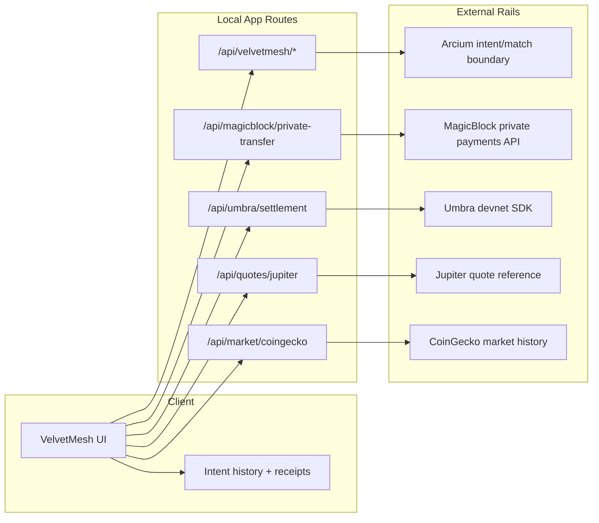
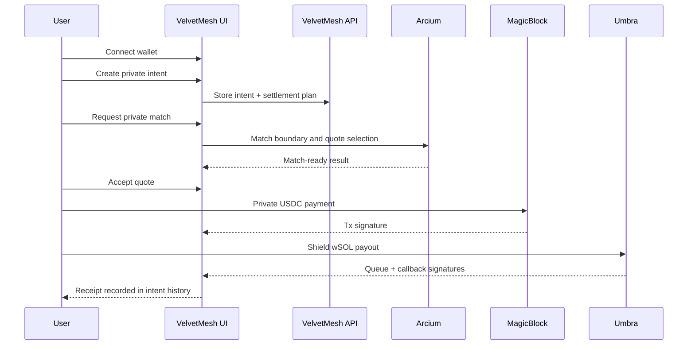

# VelvetMesh Frontend

<p align="center">
  <strong>Private Intent Trading Frontend for Solana</strong><br/>
  VelvetMesh turns the swap surface into a private intent flow with Arcium match verification, MagicBlock payment execution, and Umbra shielded payout support.
</p>

<p align="center">
  
  
  
</p>

---

## Overview

VelvetMesh is the frontend for a private, devnet-only trade flow on Solana. It does not present itself as a generic sponsor demo. The product story is:

- **Arcium** verifies private quotes and match results.
- **MagicBlock** executes the private USDC payment leg.
- **Umbra** shields the wSOL payout balance after settlement.
- **VelvetSwap** remains the confidential AMM fallback and market reference layer.

The UI shows the live market reference, the private intent lifecycle, and the settlement receipts for each accepted match.


```mermaid
graph LR
    subgraph "Client"
        UI["VelvetMesh UI"]
        HISTORY["Intent history + receipts"]
    end

    subgraph "Local App Routes"
        JUP["/api/quotes/jupiter"]
        CG["/api/market/coingecko"]
        VM["/api/velvetmesh/*"]
        MB["/api/magicblock/private-transfer"]
        UM["/api/umbra/settlement"]
    end

    subgraph "External Rails"
        ARCIUM["Arcium intent/match boundary"]
        MAGIC["MagicBlock private payments API"]
        UMBRA["Umbra devnet SDK"]
        JUPITER["Jupiter quote reference"]
        CGECKO["CoinGecko market history"]
    end

    UI --> JUP
    UI --> CG
    UI --> VM
    UI --> MB
    UI --> UM
    UI --> HISTORY
    VM --> ARCIUM
    MB --> MAGIC
    UM --> UMBRA
    JUP --> JUPITER
    CG --> CGECKO
```

---

## What The App Does

- Creates a private intent on devnet.
- Requests or seeds private maker quotes.
- Requests an Arcium private match.
- Accepts the selected quote when it becomes match-ready.
- Settles the USDC leg privately through MagicBlock.
- Shields the wSOL payout balance through Umbra.
- Persists receipts and history for the connected wallet.
- Displays a market chart and quote reference so the flow feels like a product, not an infra toy.

---

## Tech Stack

| Component | Technology |
|-----------|------------|
| Framework | Next.js 14 App Router |
| Styling | TailwindCSS + custom CSS |
| Wallets | Solana Wallet Adapter |
| Chain | Solana Devnet |
| Quote reference | Jupiter + CoinGecko |
| Private payment rail | MagicBlock Private Payments API |
| Shielded payout rail | Umbra SDK |
| Match boundary | Arcium-backed intent flow |

---

## Local Setup

### Prerequisites

- Node.js 18+
- A Solana devnet wallet in Phantom, Solflare, or Backpack
- Devnet SOL for testing

### Install

```bash
npm install
npm run dev
```

Open [http://localhost:3000](http://localhost:3000).

### Environment

Create `.env.local`:

```env
NEXT_PUBLIC_HELIUS_RPC_URL=https://devnet.helius-rpc.com/?api-key=YOUR_KEY
UMBRA_SOLANA_WS_URL=wss://devnet.helius-rpc.com/?api-key=YOUR_KEY
UMBRA_SETTLEMENT_PRIVATE_KEY=[1,2,3,...,64]
```

The Umbra signer must stay local and ignored by git. The app fails closed if the settlement config is missing.

---

## User Flow


```mermaid
sequenceDiagram
    participant User
    participant UI as VelvetMesh UI
    participant VM as VelvetMesh API
    participant Arcium
    participant MagicBlock
    participant Umbra

    User->>UI: Connect wallet
    User->>UI: Create private intent
    UI->>VM: Store intent + settlement plan
    User->>UI: Request private match
    UI->>Arcium: Match boundary and quote selection
    Arcium-->>UI: Match-ready result
    User->>UI: Accept quote
    User->>MagicBlock: Private USDC payment
    MagicBlock-->>UI: Tx signature
    User->>Umbra: Shield wSOL payout
    Umbra-->>UI: Queue + callback signatures
    UI-->>User: Receipt recorded in intent history
```

---

## Files Worth Knowing

- `src/app/page.tsx`: main UI and flow orchestration.
- `src/app/api/velvetmesh/*`: private intent and history endpoints.
- `src/app/api/magicblock/private-transfer/route.ts`: MagicBlock settlement route.
- `src/app/api/umbra/settlement/route.ts`: Umbra shielding route.
- `src/lib/velvet-mesh-client.ts`: private intent client.
- `src/lib/magicblock-private-payments.ts`: MagicBlock client.
- `src/lib/umbra-settlement.ts`: Umbra devnet settlement helpers.

---

## Related

| Resource | Link |
|----------|------|
| VelvetMesh program repo | [Velvet_swap_program](https://github.com/VelvetSwap/Velvet_swap_program) |
| MagicBlock docs | https://docs.magicblock.gg/ |
| Umbra docs | https://docs.umbra.cash/ |
| Solana Explorer | https://explorer.solana.com |

---

## License

MIT
