# VelvetRope 🛡️

**Privacy-First Confidential Swap Terminal for Solana**

VelvetRope delivers confidential swaps on Solana using Inco Lightning encrypted math and MagicBlock PER.

## Architecture Overview


## Privacy Stack

| Layer | Technology | What It Hides |
|-------|------------|---------------|
| **Confidential Swaps** | Velvet Swap + Inco Lightning | Pool reserves, swap amounts, fee accounting |

## Features

- **Encrypted AMM** — Pool reserves stored as `Euint128` ciphertext; all math happens on encrypted values
- **Encrypted Quotes** — UI displays ciphertext-only outputs before submitting swaps
- **Permissioned Execution** — MagicBlock PER gates confidential state updates
- **Confidential SPL Transfers** — Swap legs move encrypted balances between pool + user

## Tech Stack

| Component | Technology |
|-----------|------------|
| Framework | Next.js 14 (App Router) |
| Styling | TailwindCSS |
| Wallet | Solana Wallet Adapter |
| Confidential AMM | [Velvet Swap](https://github.com/your-username/velvet-swap) |
| Encrypted Math | [Inco Lightning](https://www.inco.network) |
| Access Control | [MagicBlock PER](https://docs.magicblock.gg) |
| RPC | [Helius](https://helius.dev) |

## 📦 Installation

```bash
# Clone the repository
git clone https://github.com/your-username/velvet-rope.git
cd velvet-rope

# Install dependencies
npm install

# Copy environment file
cp .env.example .env.local

# Add your Helius RPC URL to .env.local
# Get one free at https://helius.dev
```

## 🚀 Quick Start

```bash
# Development
npm run dev

# Production build
npm run build
npm start
```

Open [http://localhost:3000](http://localhost:3000) to see VelvetRope in action.

## 🔑 Environment Variables

Create a `.env.local` file with:

```env
# Required: Helius RPC
NEXT_PUBLIC_HELIUS_RPC_URL=https://mainnet.helius-rpc.com/?api-key=YOUR_KEY

# Optional: MagicBlock PER (ephemeral RPC)
NEXT_PUBLIC_EPHEMERAL_RPC_URL=https://<tee-endpoint>

# Optional: pre-created confidential mints
NEXT_PUBLIC_CONFIDENTIAL_MINT_A=...
NEXT_PUBLIC_CONFIDENTIAL_MINT_B=...
```

See `.env.example` for all configuration options.

## How It Works

### Confidential Swap Flow (Velvet Swap)

```mermaid
sequenceDiagram
    participant User
    participant UI as VelvetRope UI
    participant Wallet
    participant VS as Velvet Swap
    participant Inco as Inco Lightning

    User->>UI: Select swap (Token A → Token B)
    UI->>VS: Request encrypted quote
    VS->>Inco: Encrypted math (reserves, amounts)
    Inco-->>VS: Ciphertext result
    VS-->>UI: Quote (ciphertext only)
    UI->>User: Display encrypted quote
    User->>Wallet: Approve transaction
    Wallet->>VS: Submit swap_exact_in
    VS->>Inco: Update encrypted reserves
    VS-->>UI: ✓ Swap complete
```



## Use Cases

- **Private OTC Trading** — Encrypted swaps without revealing order sizes
- **Treasury Management** — Rebalance holdings without public visibility
- **Market Making** — Confidential LP management without leaking inventory

## 🧪 Testing

```bash
# Run on devnet for testing
NEXT_PUBLIC_SOLANA_NETWORK=devnet npm run dev
```

## 🚢 Deployment

Deploy to Vercel:

[](https://vercel.com/new/clone?repository-url=https://github.com/your-username/velvet-rope)

Or deploy to any Node.js hosting:

```bash
npm run build
npm start
```

## Project Structure

```
src/
├── app/
│   └── page.tsx           # Confidential swap UI
├── lib/
│   └── private-swap.ts    # Velvet Swap helpers
```

## Related Repositories

| Repository | Description |
|------------|-------------|
| [Velvet Swap](https://github.com/your-username/velvet-swap) | Confidential AMM program (Anchor/Rust) |
| [Inco Lightning](https://github.com/Inco-fhevm/inco-solana-programs) | Confidential SPL tokens |

## License

MIT

## Links

- [Architecture Docs](./ARCHITECTURE.md)
- [Helius RPC](https://helius.dev)
- [MagicBlock PER](https://docs.magicblock.gg)

---

Built for **Solana Privacy Hack 2026** 🏴‍☠️
